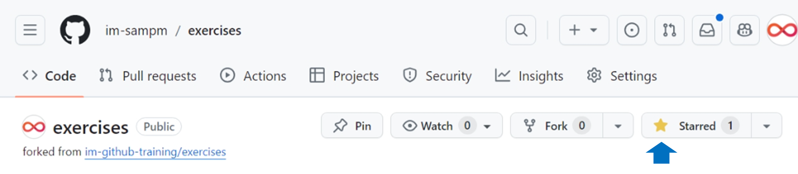
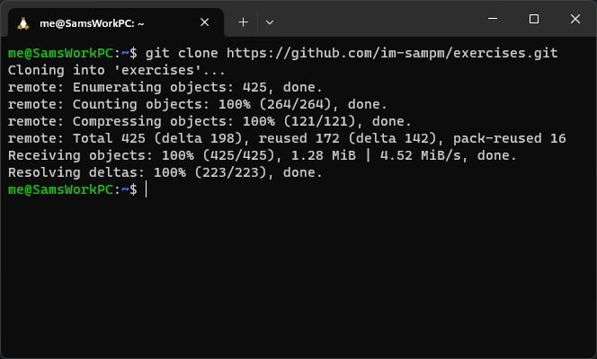

<header>

# InfoMagnus GitHub Training Platform

</header>

## Welcome

Welcome to the InfoMagnus GitHub Training Platform.  

## Step 1: Fork this repository

1. Click the `Fork` button on the repository site.

1. Set "Owner *" to your GitHub handle
1. Check the "Copy the `main` branch only" box
1. Click the "Create fork" button!

## Step 2: Enable Actions

Click on the 'Actions' in your forked repo.

Click on "I understand my workflows, go ahead and enable them" (you"ll have to trust us)

Then, click "exercises" to return back to the home screen.

## Step 3: Star Your Repo!

<footer>

&copy; 2024 InfoMagnus &bull; [Code of Conduct](https://www.contributor-covenant.org/version/2/1/code_of_conduct/code_of_conduct.md) &bull; [MIT License](https://gh.io/mit)

</footer>
