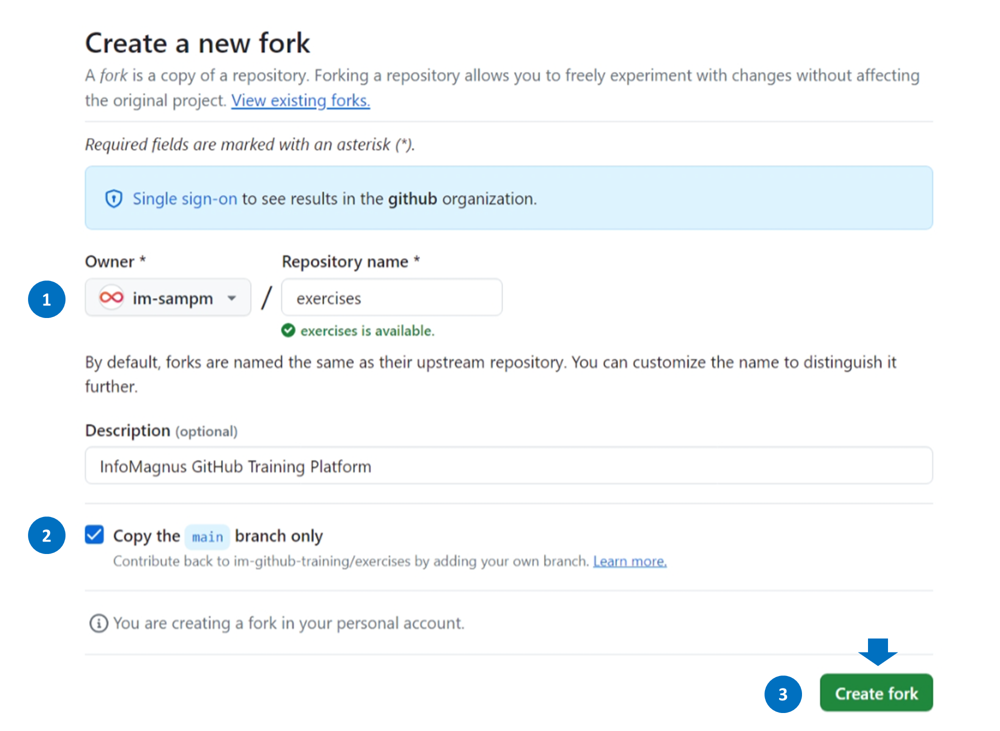
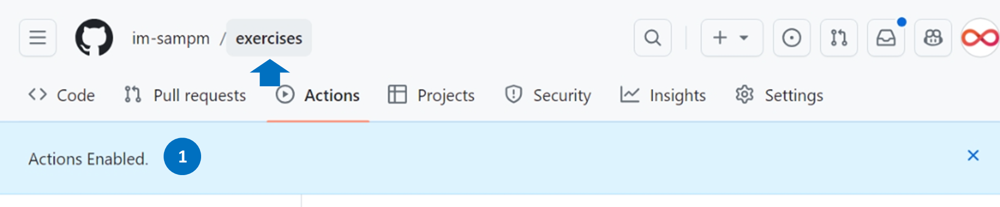
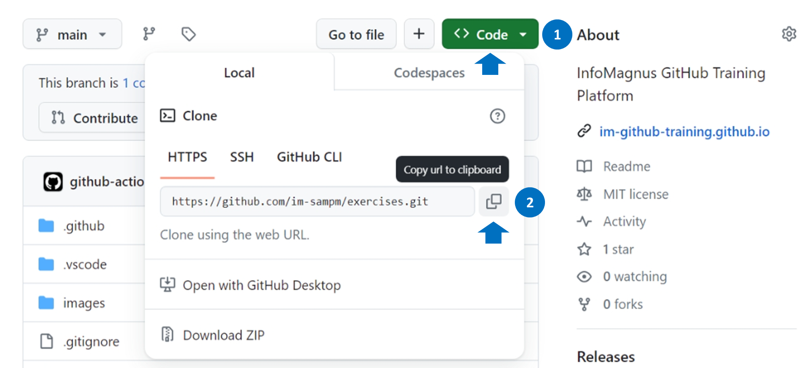

<header>

# InfoMagnus GitHub Training Platform

</header>

## Welcome

Welcome to the InfoMagnus GitHub Training Platform.  

## Step 1: Fork this repository

### Click the `Fork` button on the repository site.

### Make sure the following options are set:
### 1. Set "Owner *" to your GitHub handle
### 2. Check the "Copy the `main` branch only" box
### 3. Click the "Create fork" button!

## Step 2: Enable Actions

### Click on the 'Actions' in your forked repo.

### Click on "I understand my workflows, go ahead and enable them" (you'll have to trust us)

### Then, click "exercises" to return back to the home screen.

## Step 3: Star Your Repo!

<footer>

&copy; 2024 InfoMagnus &bull; [Code of Conduct](https://www.contributor-covenant.org/version/2/1/code_of_conduct/code_of_conduct.md) &bull; [MIT License](https://gh.io/mit)

</footer>
