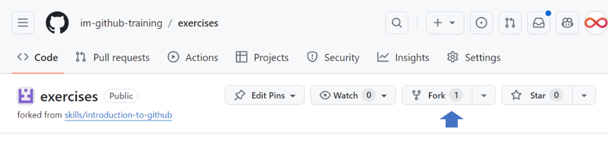
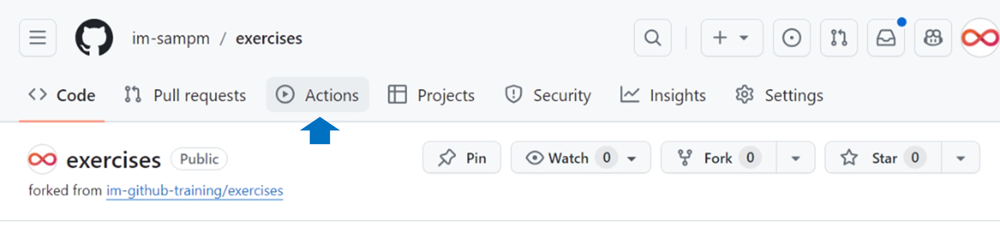
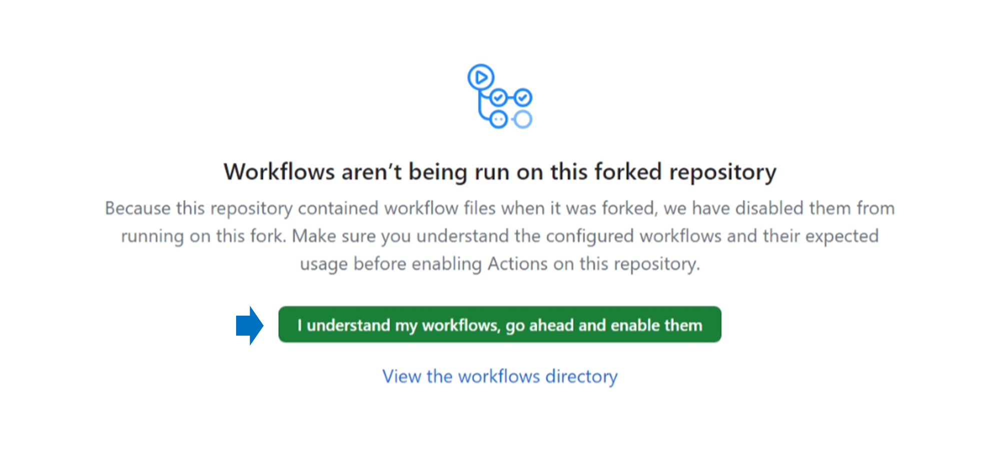

<header>

# InfoMagnus GitHub Training Platform

</header>

## Welcome

Welcome to the InfoMagnus GitHub Training Platform

This repository is part of the [InfoMagnus GitHub Training Guide](https://im-github-training.github.io/).

<!-- Write an introductory paragraph for this turtorial -->

In this tutorial, we'll cover the basics of Git and GitHub by working through a series of exercises.  We'll start with the basics of creating a repository, working with branches, and making commits.  From there, we'll cover more advanced topics such as merging, rebasing, and pull requests.

### Prerequisites

To complete this tutorial, you will need a basic understanding of the terminal (or command line).  If you're new to the terminal, we recommend checking out [Codecademy's Command Line Course](https://www.codecademy.com/learn/learn-the-command-line).

You'll also need to have Git installed on your machine and a GitHub account.  If you need help with this, please see:

* [Setting up Git]()
* [Setting up GitHub]()

### Recommended Reading

We recommend reading the following sections of the [InfoMagnus GitHub Training Guide](https://im-github-training.github.io/):

* [What is Git?](https://im-github-training.github.io/#/./docs/basic/git/what-is-git)
* [What is GitHub?](https://im-github-training.github.io/#/./docs/basic/github/what-is-github)
* [What is a Repository?](https://im-github-training.github.io/#/./docs/basic/git/repositories)
* [What is a Branch?](https://im-github-training.github.io/#/./docs/basic/git/branches)
* [What is a Commit?](https://im-github-training.github.io/#/./docs/basic/git/commits)

## Step 1: Fork this repository

1. Click the `Fork` button on the repository site.

1. Set "Owner *" to your GitHub handle
1. Check the "Copy the `main` branch only" box
1. Click the "Create fork" button!

## Step 2: Enable Actions

Click on the 'Actions' in your forked repo.

Click on "I understand my workflows, go ahead and enable them" (you"ll have to trust us)

Then, click "exercises" to return back to the home screen.

## Step 3: Star Your Repo

<footer>

&copy; 2024 InfoMagnus &bull; [Code of Conduct](https://www.contributor-covenant.org/version/2/1/code_of_conduct/code_of_conduct.md) &bull; [MIT License](https://gh.io/mit)

</footer>
